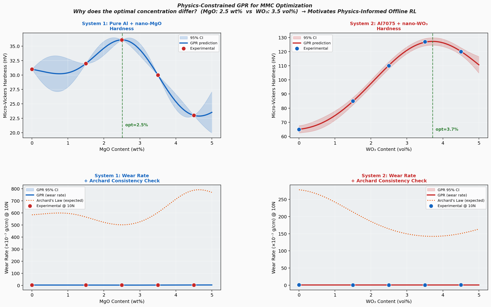

# Physics-Constrained GPR for MMC Process Optimization

> **Core question:** Why does the optimal reinforcement concentration differ between two Al-MMC systems — and can we predict it for a new system without exhaustive experimentation?

---

## Motivation

In two published experimental studies, I characterized two distinct Al nanocomposite systems fabricated by powder metallurgy:

| System | Matrix | Reinforcement | Optimal Concentration |
|--------|--------|---------------|-----------------------|
| 1 | Pure Al + 5wt% Graphite | nano-MgO | **2.5 wt%** |
| 2 | Al7075 + 5vol% Graphite | nano-WO₃ | **3.5 vol%** |

Both systems follow the same physics — Orowan strengthening improves hardness up to a threshold, then porosity and agglomeration dominate. Yet the threshold differs. **Why?**

This project uses Gaussian Process Regression (GPR) to model both systems, imposes physics constraints from Archard's Law, and uses the cross-system comparison to motivate the central research question of my PhD proposal.

---

## Results



**GPR-predicted optima (vs experimental):**
- MgO system: **2.51 wt%** (exp: 2.5 wt%) ✓  
- WO₃ system: **3.72 vol%** (exp: 3.5 vol%) ✓

---

## Approach

### 1. Gaussian Process Regression
GPR with RBF kernel provides uncertainty quantification (95% confidence intervals), which is essential when experimental data is sparse — a fundamental limitation of physical materials experiments.

### 2. Physics Constraints — Archard's Law
```
W = K · (N · S) / (C · H)
```
where W = wear loss, N = applied load, S = sliding distance, H = hardness.

GPR predictions of wear rate are checked for consistency with Archard's Law. Predictions that violate the expected inverse relationship with hardness are flagged — this is physics-informed machine learning.

### 3. Cross-System Comparison
The differing optima are explained by the matrix strength hypothesis:
- **Pure Al** (baseline hardness: 31 HV) — agglomeration effects dominate at lower concentrations
- **Al7075 alloy** (baseline hardness: 65 HV) — stronger matrix tolerates higher reinforcement before agglomeration is detrimental

---

## Research Gap → PhD Proposal

GPR can **predict** properties at a given concentration.  
GPR **cannot prescribe** the optimal manufacturing sequence (sintering temperature, pressing pressure, mixing time) to *achieve* that concentration with desired microstructure.

This motivates an **Offline Reinforcement Learning** extension:
- State: microstructural features (porosity, particle distribution, hardness)  
- Action: process parameters (sintering T°, pressure, mixing time)  
- Reward: deviation from target property profile  
- Offline constraint: we cannot run unlimited physical experiments

The combination of Physics-Constrained GPR (property prediction) + Offline RL (process optimization) forms the core of the proposed research.

---

## Repository Structure

```
mmc-gpr-optimizer/
├── README.md
├── data/
│   ├── mgo_system.csv        ← Pure Al + nano-MgO (AIMS Mater. Sci. 2020)
│   └── wo3_system.csv        ← Al7075 + nano-WO₃ (Mater. Sci. Forum 2020)
├── notebooks/
│   └── gpr_analysis.py       ← GPR models + physics constraints + figures
└── results/
    └── figures/
        └── gpr_comparison.png
```

---

## Publications (Data Sources)

1. Irhayyim SS, Hammood HS, **Mahdi AD** (2020). *Mechanical and wear properties of hybrid aluminum matrix composite reinforced with graphite and nano MgO particles prepared by powder metallurgy technique.* AIMS Materials Science, 7(1): 103–115. DOI: 10.3934/matersci.2020.1.103

2. **Mahdi AD**, Irhayyim SS, Abduljabbar SF (2020). *Mechanical and Wear Behavior of Al7075-Graphite Self-Lubricating Composite Reinforced by Nano-WO₃ Particles.* Materials Science Forum, Vol. 1002, pp. 151–160.

---

## Requirements

```
numpy
pandas
scikit-learn
matplotlib
```

```bash
pip install numpy pandas scikit-learn matplotlib
python notebooks/gpr_analysis.py
```
